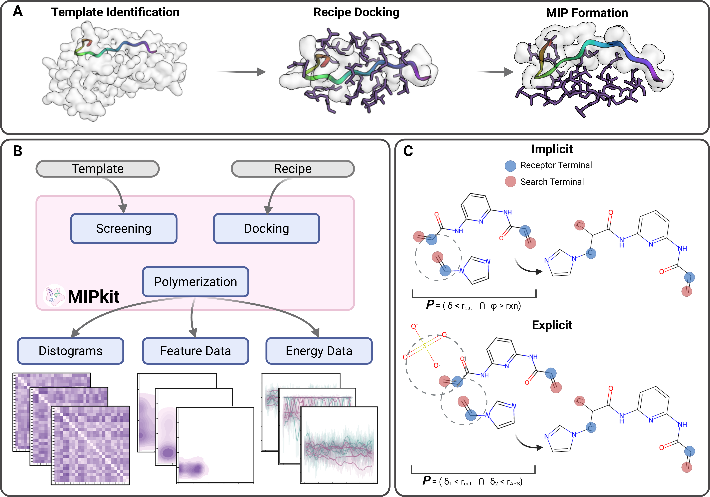

---
hide:
  - navigation
  - toc
---

---
# MIPkit
<!-- ### Automated Screening, Docking, Precomplexation, and Complexation for Molecularly Imprinted Polymers -->

## Molecularly Imprinted Polymers (MIPs)
<figure markdown="span">
{: style="transform: scale(0.75);"}
  <figcaption>Overview of MIP development, made with Biorender.</figcaption>
</figure>

Molecularly Imprinted Polymers (MIPs) are synthetic recognition elements tailored to specific biomarkers, ligands, and ions. Unlike organically derived receptors, MIPs are polymer matrices generated about the desired analyte from a range of functional monomers (FMs), bypassing the need for identification and isolation of natural biorecognition elements.

## Purpose

<figure markdown="span">
{: style="transform: scale(0.75);"}
  <caption>(A) Polymerization steps of MIPkit. First, a template is identified within a protein, after which it is docked and polymerized. (B) Templates and Recipes are inputs for screening and docking, which allows MIPkit to develop precomplex structures for polymerization simulations. Final MIPs and NIPs can be analyzed with the standard range of GROMACS tools, but is coded to auto export Lennard-Jones and Coulombic energies, Radial Distribution Functions, and H-Bond counts of FM-Template and FM-Amino Acid pairings. (C) MIPkit's polymerization can proceed as either explicit or implicit. Implicit omits initiators, while explicit relies on them. More information on supported initiators can be found under "Supported Solvents and Initiators".</caption>
  <figcaption>Made with Biorender.</figcaption>
</figure>

MIPkit is designed to simplify the MIP recipe development process by standardizing libraries, docking procedures, and GROMACS environments. Given an identified template, functional monomers can be screened, allowing for selection of best performing monomers. From here, a recipe can be developed and docked to the template. This provides the precomplex structure that can be polymerized to develop MIPs and NIPs for comparison.

## Bioinspired Materials and Biosensor Technologies (BMBT)

BMBT is chaired by Prof. Dr. Zeynep Altintas at Christian-Albrechts-Universit&auml;t zu Kiel, specializing in a range of biosensing and biomaterial technologies. Clicking the globe in the footer will bring you to the group website.

For any issues, please open an issue on the GitHub page. If you have suggestions for features, please open a discussion.