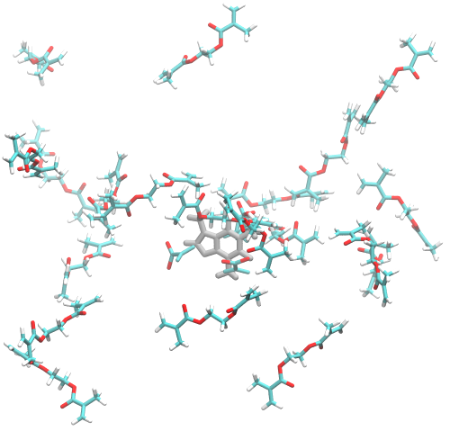

---
hide:
  - toc
---

# Caffeine

---

## Preparation

A simple example of MIP polymerization is that given by [Teixeira et al.](https://doi.org/10.1016/j.microc.2020.105252). The caffeine in this example is in a solution of acetonitrile, with the polymerization of MAA and EGDMA initiated by ACPA in a molar ratio of 1:4:20:~0.25. Depending on the template, heavily docked small molecules will result in structures with high energies that will be unstable in Gromacs. To supplement the 4 initial MAA, we can use `insert-molecules`.

The config file generated should look something like this:

    center:
    - -0.034
    - 0.006
    - -0.105
    # only for Vina
    energy_range: 4
    # for both Vina and gnina, default is 10
    exhaustiveness: 100
    fms:
    - MAA
    - 4
    protein: caffeine.pdb
    scale: 1
    size:
    - 30
    - 40
    - 20

     Interval    FM      gnina        gnina       Affinity     Intramol  
                       pose score    affinity    (kcal/mol)   (kcal/mol)  
        0     MAA        0.876        3.645        -0.680        0.000
        1     MAA        0.855        3.758        -0.300        0.000
        2     MAA        0.466        2.755        9.370         0.000
        3     MAA        0.579        3.107        4.700         0.000
     Precomplexation ━━━━━━━━━━━━━━━━━━━━━━━━━━━━━━━━━━━━━━━━ 100% 0:00:07

## Inserting Cross-linkers

<figure markdown="span">
{: style="transform: scale(1);"}
  <figcaption>Caffeine with docked MAA and inserted EGDMA.</figcaption>
</figure>

To add more functional monomers to the system, we can use `gmx insert-molecules`. First, we can use `MIPkit -write_pdb EGDMA` to write out a EGDMA fm to a pdb file in our directory. Then, we can do:

    # Center in our 4 x 4 x 4 box
    gmx editconf -f caffeine.pdb -translate 2 2 2 -o caffeine-c.pdb
    gmx editconf -f maa-4-gnina.pdb -translate 2 2 2 -o maa-c.pdb
    gmx insert-molecules -f maa-c.pdb -ci EGDMA.pdb -nmol 20 -o recipe.pdb -box 4 4 4

to insert 20 EGDMA monomers into an 4 x 4 x 4 nm box. 

---

## Polymerization

Compared to a fully docked system, we are losing some initial configuration benefits. However, considering EGDMA is the crosslinker, we can likely assume that MAA will be contributing most of the interaction energy.

Since we are targeting caffeine, we will use the `-template` option rather than `-protein`. This avoids the use of `gmx pdb2gmx`, which expects amino acids as residues rather than whatever we are giving it. Now using `caffeine.pdb` as our template and `recipe.pdb`, we can begin the process with:

    MIPkit -react -template "caffeine.pdb" -cplx "recipe.pdb" -implicit 0 -box 4 4 4 -min -cycles 0

This will populate a 4 x 4 x 4 nm box with water and run a minimization that we can then use with acetonitrile to replicate the experiment. This minimization is necessary as solvating directly with MeCN can result in a higher energy simulation that will trigger errors in GROMACS.

    MIPkit -react -template "caffeine.pdb" -cplx "recipe.pdb" -solvent mcn -explict acpa -box 4 4 4 -min -cycles 20

---

### Potential Errors
* CUDA Assertion Error: Small molecule docking seems to be a common pain point. This error is typically due to high energy configurations causing singularity and memory errors within GROMACS, and is the result of high energy docked configurations generated in GNINA and VINA. If this occurs, try minimizing, docking only the functional monomers, or bypassing docking altogether using gmx insert-molecules.