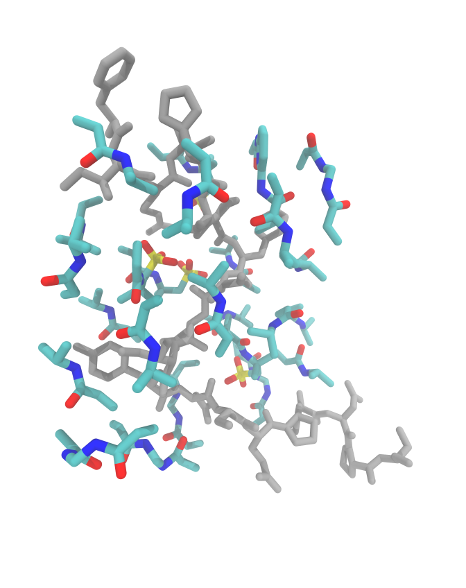
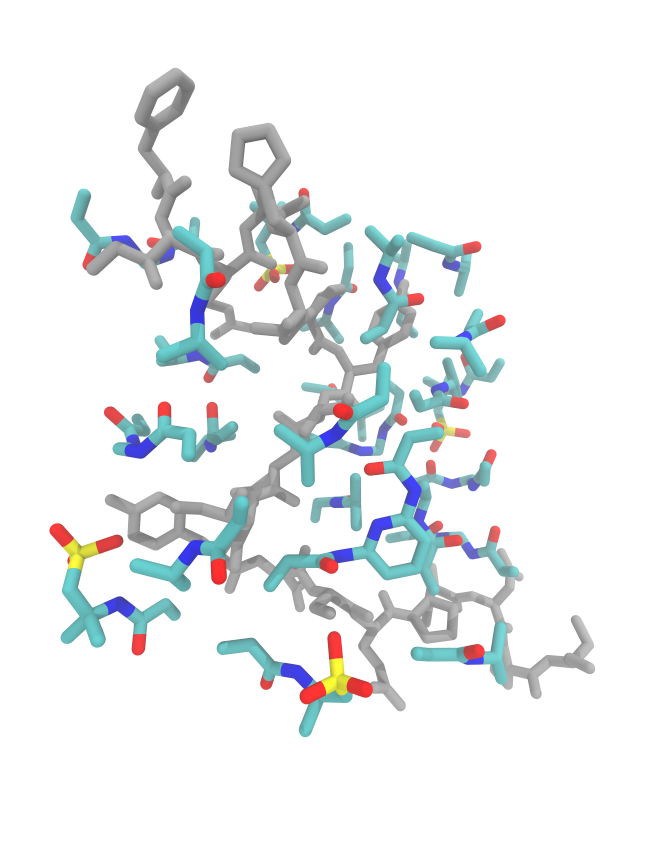
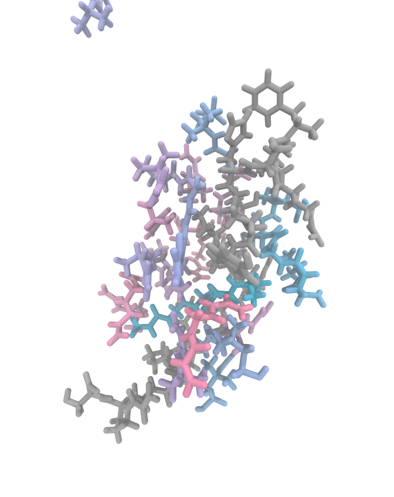
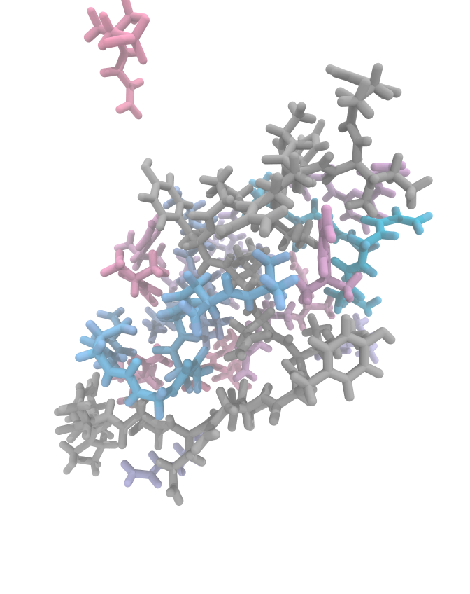

---
hide:

---

# CD20 Epitope

---

## Preparation : -dock

    center:
    - 146.284
    - 157.686
    - 146.331
    energy_range:
    - 4
    exhaustiveness:
    - 100
    fms:
    - AMPSA
    - 4
    - BAAPY
    - 1
    - NIPAM
    - 15
    - BIS
    - 5
    protein: CD20-epitope.pdb
    scale: 1
    size:
    - 16
    - 31
    - 27

### Serial
By default, functional monomers are docked in the system in the order they are given.

    MIPkit -dock -protein CD20-epitope.pdb -config cd20_complex.yaml

    Interval    FM    Mean RMSD    Affinity   Score  
        0     AMPSA     3.917      -3.188      -0.915 
        1     AMPSA     12.500     -3.090      -0.254 
        2     AMPSA     3.442      -2.695      -0.855 
        3     AMPSA     16.235     -2.652      -0.166 
        4     26-BAP    13.025     -3.680      -0.303 
        5     NIPAM     16.110     -2.212      -0.141 
        6     NIPAM     15.540     -2.230      -0.147 
        7     NIPAM     12.740     -2.181      -0.172 
        8     NIPAM     10.895     -2.240      -0.210 
        9     NIPAM     9.521      -2.152      -0.233 
        10    NIPAM     5.469      -2.285      -0.430 
        11    NIPAM     10.755     -2.195      -0.206 
        12    NIPAM     15.790     -2.348      -0.150 
        13    NIPAM     5.473      -2.273      -0.437 
        14    NIPAM     12.125     -2.219      -0.185 
        15    NIPAM     17.585     -2.201      -0.126 
        16    NIPAM     20.575     -2.127      -0.104 
        17    NIPAM     16.960     -2.152      -0.128 
        18    NIPAM     20.060     -2.144      -0.108 
        19    NIPAM     4.176      -2.097      -0.531 
        20    BIS       10.470     -2.828      -0.271 
        21    BIS       16.015     -2.790      -0.178 
        22    BIS       18.500     -2.660      -0.146 
        23    BIS       21.315     -2.700      -0.129 
        24    BIS       13.075     -2.668      -0.208 
    Precomplexation ━━━━━━━━━━━━━━━━━━━━━━━━━━━━━━━━━━━━━━━━ 100% 0:02:15

### Shuffle
Alternatively, we can add all functional monomers in a shuffled manner using `-shuffle`.

    MIPkit -dock -protein CD20-epitope.pdb -config cd20_complex.yaml -shuffle -shuffle_seed "xF00D"

    Interval    FM    Mean RMSD    Affinity   Score  
        0     NIPAM     3.688      -2.596      -0.719 
        1     NIPAM     7.901      -2.420      -0.312 
        2     NIPAM     8.162      -2.432      -0.302 
        3     NIPAM     12.940     -2.268      -0.181 
        4     BIS       11.490     -2.856      -0.255 
        5     NIPAM     10.675     -2.333      -0.224 
        6     BIS       4.574      -2.830      -0.703 
        7     NIPAM     10.575     -2.280      -0.221 
        8     AMPSA     17.795     -2.638      -0.150 
        9     NIPAM     17.530     -2.465      -0.142 
        10    BIS       22.955     -2.878      -0.126 
        11    NIPAM     14.290     -2.358      -0.166 
        12    26-BAP    12.860     -3.753      -0.300 
        13    BIS       18.655     -2.873      -0.157 
        14    NIPAM     14.425     -2.122      -0.148 
        15    NIPAM     15.025     -2.258      -0.151 
        16    NIPAM     13.910     -2.184      -0.158 
        17    NIPAM     16.590     -2.299      -0.140 
        18    BIS       13.990     -2.689      -0.196 
        19    NIPAM     15.195     -2.237      -0.149 
        20    NIPAM     16.950     -2.124      -0.127 
        21    AMPSA     13.840     -2.426      -0.178 
        22    NIPAM     15.400     -2.156      -0.142 
        23    AMPSA     17.365     -2.506      -0.146 
        24    AMPSA     12.025     -2.442      -0.209 
    Precomplexation ━━━━━━━━━━━━━━━━━━━━━━━━━━━━━━━━━━━━━━━━ 100% 0:02:18

### Serial vs Shuffle
Serial and Shuffle give different results, which will almost certainly give us different trajectories. Similarly, `-shuffle` by itself will do the same, with `-shuffle_seed` giving us the a method of controlling the randomness to some degree (at least the starting configuration).

**Serial**                 |**Shuffle**
:-------------------------:|:-------------------------:
  |  

Here we can see the side by sides of shuffle and serial. AMPSA is the most clear difference due to its location in the config file. In serial, it has docked on the surface of the epitope and is surrounded by NIPAM and cross-linkers. However, when it gets shuffled, some are docked on the outside, which lowers its chances of contributing to the MIP.

---

## GROMACS : -react

To demonstrate the differences from starting conditions, we will run directly from the docked position rather than the equilibration `-min`. Since this is just a tutorial and not a full production run, we will only use 10 cycles. We will also use `-gmxt short` to use a 0.5 ns cycle.

### Serial
    MIPkit -react -protein CD20-epitope.pdb -cplx CD20-serial.pdb -cutoff 3.3 -gmxt short

    =====================================================================
	BMBT MIPkit
	DOI:
	Barrett et al.
    =====================================================================

    + Reaction run.
    + GMX -short selected. This will run 0.5 ns per cycle, totalling 5.0 ns.
    + Implicit reaction with probability 1.0 and cutoff 3.3.

    Complexation using 8 cores.
    Accelerating with -gpu_id 0
    Precomplex : CD20-serial.pdb 
    Template : CD20-epitope.pdb.
    ======================================================================
      Step   Nmono Npoly     MW-Navg     MW-Wavg       MWmax       MWmin
    ======================================================================
      0         25     0      140.48      150.67      217.09      113.08
      1         25     0      140.48      150.67      217.09      113.08
      2         25     0      140.48      150.67      217.09      113.08
      3         25     0      140.48      150.67      217.09      113.08
      4         25     0      140.48      150.67      217.09      113.08
      5         23     1      146.41      169.15      363.15      113.08
      6         23     1      146.41      169.15      363.15      113.08
      7         22     1      152.87      192.96      478.25      113.08
      8         22     1      152.87      192.96      478.25      113.08
      9         22     1      152.87      192.96      478.25      113.08
      Complexation ━━━━━━━━━━━━━━━━━━━━━━━━━━━━━━━━━━━━━━━━ 100% 0:24:51

So we can see that polymerization only just began with our system, with only three functional monomers reacting to form a single chain. If you want to analyze the statistics over time, the same molecular weight stats will are printed to `./work/stats-polymerization.log`.

### Shuffle
    MIPkit -react -protein CD20-epitope.pdb -cplx CD20-shuffle.pdb -cutoff 3.3 -gmxt short

    =====================================================================
	BMBT MIPkit
	DOI:
	Barrett et al.
    =====================================================================

    + Reaction run.
    + GMX -short selected. This will run 0.5 ns per cycle, totalling 5.0 ns.
    + Implicit reaction with probability 1.0 and cutoff 3.3.

    Complexation using 8 cores.
    Accelerating with -gpu_id 0
    Precomplex : CD20-shuffle.pdb 
    Template : CD20-epitope.pdb.
    ======================================================================
      Step   Nmono Npoly     MW-Navg     MW-Wavg       MWmax       MWmin
    ======================================================================
      0         25     0      140.48      150.67      217.09      113.08
      1         25     0      140.48      150.67      217.09      113.08
      2         21     2      152.87      168.25      269.17      113.08
      3         20     2      159.91      192.21      425.26      113.08
      4         19     2      167.52      206.88      425.26      113.08
      5         17     3       176.0      216.97      425.26      113.08
      6         16     3      185.37      254.72      581.35      113.08
      7         15     3      195.78       278.6      581.35      113.08
      8         15     3      195.78       278.6      581.35      113.08
      9         15     3      195.78       278.6      581.35      113.08
      Complexation ━━━━━━━━━━━━━━━━━━━━━━━━━━━━━━━━━━━━━━━━ 100% 0:24:46

`-shuffle` faired a bit differently, with the chains forming and growing much faster, with a total of 10 monomers consumed by 3 chains in 10 steps.  We can see who contributed to this growth by inspecting `./logs/bmbt-polymerization.log`, which will contain :

    Bonding NIPAM 7 and NIPAM 6 (14) as X0
    Bonding BIS 0 and NIPAM 6 (17) as X1
    Bonding BIS 0 and X1 9 (20) as X2
    Bonding NIPAM 7 and X0 15 (23) as X3
    Bonding BIS 0 and NIPAM 6 (17) as X4
    Bonding X2 10 and BIS 1 (31) as X5
    Bonding BIS 10 and X4 9 (20) as X6

In MIPkit, X$ will always be a polymer chain, with each reaction increasing by 1. So during the formation of one polyNIPAM chain, we see NIPAM + NIPAM > X0, then NIPAM + X0 > X3.

### Serial vs Shuffle

**Serial**                 |**Shuffle**
:-------------------------:|:-------------------------:
  |  

So in looking at these stills from the last step, we can first see an AMPSA molecule wandering away from the system (in both). This happens and is one thing we discuss in the paper. The steric hinderances introduced by polymerization prevents functional monomers from leaving, increasing their contributions to interaction energy with the template molecule.

---

## GROMACS : -interact

From here, you can rerun the system with a larger cycle count to see how the polymerization progresses, or rerun it with a minimization first to see how that impacts the polymerization behavior of the system. 

### MIP vs NIP Interaction Energy
Omitting the `-template` or `-protein` flag will allow us to generate a non-imprinted polymer (NIP) from the same recipe that we generate our MIPs from

    Serial NIP :
    MIPkit -react -cplx CD20-serial.pdb -cutoff 3.3 -gmxt short

    Shuffle NIP :
    MIPkit -react -cplx CD20-shuffle.pdb -cutoff 3.3 -gmxt short

When these runs are done, we can then run interactions using:

    MIP complex Interaction (with excess FMs) :
    MIPkit -interact -cplx CD20-MIP.pdb -protein CD20-epitope-done.pdb -id -config cd20_complex.yaml

    NIP complex Interaction (with excess FMs) :
    MIPkit -interact -cplx CD20-NIP.pdb -protein CD20-epitope-done.pdb -id -config cd20_complex.yaml -offset x y z

    MIP Interaction (no loose FMs) :
    MIPkit -react -cplx CD20-MIP.pdb -protein CD20-epitope-done.pdb -wash -id -config cd20_complex.yaml

    NIP Interaction (no loose FMs) :
    MIPkit -react -cplx CD20-NIP.pdb -protein CD20-epitope-done.pdb -wash -id -config cd20_complex.yaml -offset x y z

Using `-id` and `-config` allows us to decompose any polymers into the basic functional monomers to determine FM contributions as part of the MIP/NIP structure.

---

### Potential Errors
* CUDA Assertion Error: This error is typically due to high energy configurations causing singularity and memory errors within GROMACS. This seems to happen more frequently with GNINA. If it does occur, try running a minimization with the 0.5 fs timestep and using the minimized state as the initial polymerization state.