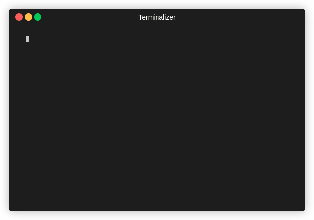

---
hide:
  - toc
---

# Quickstart

---

<figure markdown="span">
{: style="transform: scale(0.75);"}
  <figcaption></figcaption>
</figure>

We have packaged a few simple examples to get you started with MIPkit, all gathered from literature. All necessary PDB, yaml, and bash scripts needed to get started will be found in `/Examples`.

### Caffeine

* Recipe yaml
* PDB of Caffeine
* Bash script

### CD20 Epitope

* Recipe yaml
* PDB of CD20 epitope
* Bash script